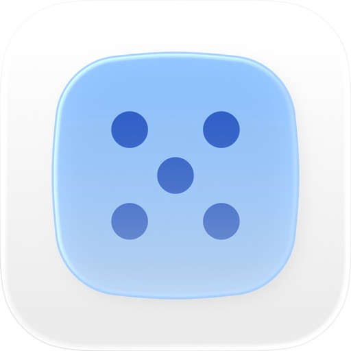
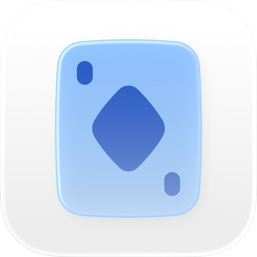

# Hi, I'm Weixuan Sun 👋

**Computer Engineering student and app developer based in Madrid.**

I turn small ideas into apps for everyday life. I'm a fourth-year Computer Engineering student at **Universidad Carlos III de Madrid**, building my own projects alongside my studies. I enjoy learning by doing and connecting the technical details with the experience of the people who use my apps.

## 📱 Apps I've built

<table>
  <tr>
    <td width="96" align="center" valign="middle">
      
    </td>
    <td>
      <h3><a href="https://pixelstime.com">PixelsTime</a></h3>
      
Make everyday decisions with spinning wheels, coin flips, and random picks.

      
iOS · Released in February 2026 after two years of development.

    </td>
  </tr>
  <tr>
    <td width="96" align="center" valign="middle">
      
    </td>
    <td>
      <h3><a href="https://muscounter.com">MusCounter</a></h3>
      
Keep score in Mus with custom scoring rules, point history, and saved matches.

      
iOS · Released in September 2026 after one year of development.

    </td>
  </tr>
</table>

## 🛠️ Technologies & tools

**Programming languages**

**Web development**

**Services**

## 🌱 A little more about me

Alongside my studies and projects, I've worked in hospitality in Madrid: as a waiter in summer 2024 and as a barista in summer 2025. These experiences helped me develop teamwork, communication under pressure, and customer service skills.

I speak **Chinese (native)**, **Spanish**, and **English (B2)**.

## ✉️ Get in touch

Have an idea, an opportunity, or just want to say hello? Reach me at **[hello@weixuansun.com](mailto:hello@weixuansun.com)**.

Find out more about me and my projects at **[weixuansun.com](https://weixuansun.com)**.
